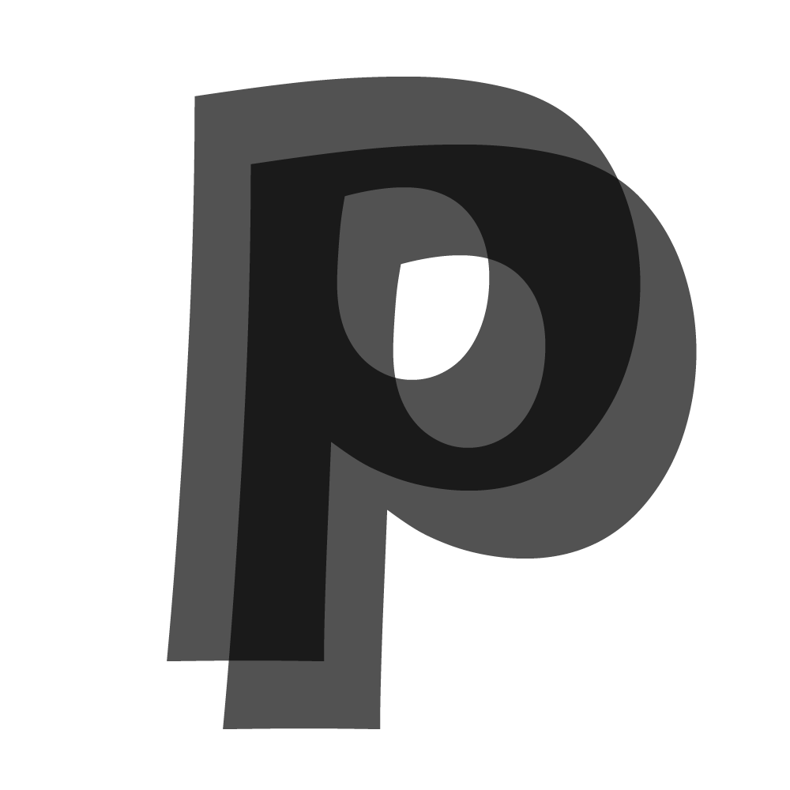
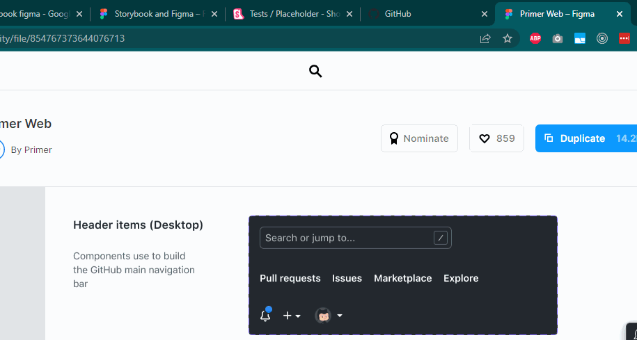
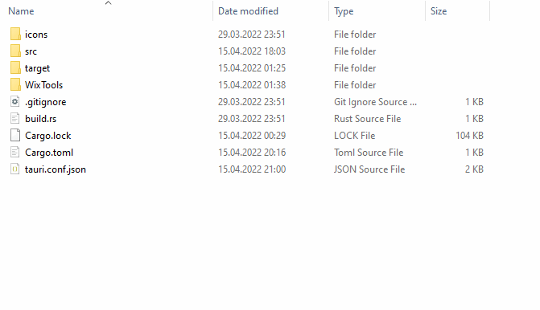

#  Pauspapier

Pauspapier is a utility tool for overlaying a transparent screenshot crop on top
of your screen. This is useful for comparing UX specifications with the corresponding
implementation to check if spacings and distances are off.



You can download the latest version of the app from [the latest GitHub release](https://github.com/lukasbach/pauspapier/releases/latest).
Pauspapier is less than 10mb in size and is available for macOS, Windows, and Linux.





## Development

Install the repo, then run

```bash
$ yarn
$ yarn tauri dev
```

for development.

To release a new version, manually dispatch the `release` Github workflow.
This will build the app for all targets, bump the version, create a new commit
and Github release, and upload the binaries and installers to the new release.
